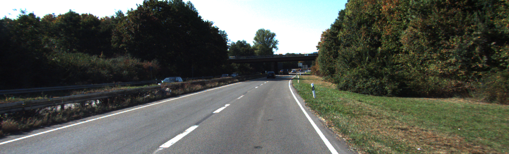

# ComputerVision
A repository featuring labs from my university's Computer Vision course, demonstrating practical applications in image processing, object detection, and segmentation.

## Computer Vision Course Projects

In this repository, I'll be documenting my progress through the Computer Vision course at my university. Throughout the course, we'll progressively implement five projects:

Project 1: Lane Detection
Project 2: Digit Recognition
Project 3: Image Stitching - Creating panoramas
Project 4: Stereo
Project 5: Object Detection using neural networks

All projects will be implemented using Python programming language and Jupyter notebooks.

Stay tuned for updates and explorations into the fascinating world of computer vision!

### Project #1 Week #1 Lane Detection Application
This project implements a lane detection application using Python, Jupyter Notebook, NumPy, and OpenCV. The application detects lane markings in images and overlays them with visualizations to highlight the detected lanes.

#### Overview
The lane detection pipeline consists of the following steps:
- Read the test image.
- Convert the image from BGR to RGB.
- Apply grayscale transformation.
- Apply Gaussian smoothing.
- Perform Canny edge detection.
- Define a region of interest.
- Apply a mask to the Canny edges.
- Overlay the detected edges on the original image.

### Week #2 Advanced Lane Detection by Fitting Lines Using Hough Transform

#### Project Overview
During Week 2 of development, the focus was on utilizing the Hough Transform to fit lines to the detected edges. While Canny edge detection provided edge information, converting these edges into lines required additional processing.

#### Hough Transform Overview:
The Hough Transform is a voting technique used to identify lines in an image.
It converts points in the image space to lines in the Hough space, allowing us to find lines based on edge points.

#### Using Hough Transform for Lane Detection:
Each edge point in the image space contributes to a set of possible parameters (m, b) in the Hough space.
The algorithm records all possible lines on which each edge point lies and identifies lines with the most votes.

#### Key Takeaways:
- Gaussian Blur: Removes noise from the image.
- Canny Edge Detection: Isolates edges in the image.
- Bitwise And Function: Isolates edges corresponding to lane lines.
- Hough Transform: Converts edges into lines for lane detection.

### Week #3: Evaluating Performance of Our Solution

#### Evaluation Metrics:

When trying out different segmentation methods, it's crucial to evaluate their performance to determine which one is best suited for the task at hand. If you have ground truth or gold standard segmentations available, you can employ various metrics to assess how closely each automated method aligns with the truth.

1. **Pixel Accuracy:**
   Pixel accuracy measures the percentage of pixels in the image that are classified correctly.
   
2. **Mean IoU (Mean Intersection over Union):**
   Mean IoU ranges from 0 to 1, with 0 indicating no overlap and 1 indicating perfect overlap between the predicted and ground truth segmentations.
   
3. **Precision:**
   Precision is a measure of exactness or quality.
   
4. **Recall:**
   Recall is a measure of completeness or quantity.
   
5. **F-Measure (Sørensen–Dice coefficient):**
   F-Measure is the harmonic mean of precision and recall, balancing both measures with equal weights. It indicates the algorithm's performance, with higher scores signifying better performance.
   
#### Computation of TP, FP, FN, TN in C++ using OpenCV:
- Given the Ground Truth (golden model) and our detected segmentation, we will compute the following metrics:
  1. TP, TN, FN, FP
  2. Accuracy, Mean IoU, Precision, Recall, F-measure

You can find the Kitti Lane Detection dataset annotated images and annotations at the following links:

Stay tuned for the results and analysis of our solution's performance on the Kitti Lane Detection dataset.

### Project #2 Week #1: License Plate Text Recognition

#### Label: B
#### Prediction output: B

1. **Introduction to Object Descriptors:**
Objects in images are represented as collections of pixels. To recognize objects, we need descriptors—specific sets of numbers describing the properties of these pixel groups. Object recognition involves matching descriptors computed for objects in images with those of known objects.

   - Shape descriptors characterize the arrangement of contour pixels (shape boundary, perimeter, margin).
   - Region descriptors define pixels within the object contour.

2. **Fourier Descriptors:**
Fourier Descriptors utilize Fourier theory properties to describe a shape. The concept involves characterizing a contour using a set of numbers representing the frequency content of the shape. By analyzing frequencies, a small number of Fourier coefficients are selected to describe the shape.

   - Fourier Descriptors (FD) are computed using the Discrete Fourier Transform (DFT) of complex numbers formed by the contour coordinates.
   - FDs represent 2D closed shapes independent of their location, scaling, rotation, and starting point.
   - Low-frequency FDs approximate the shape, while high-frequency components correspond to details susceptible to noise.
   
   To compute FDs:
   1. Find the object contour (using cv2.findContours).
   2. Create complex numbers using the (x, y) coordinates of the contour points: z = x + j*y.
   3. Compute the Fourier transform for every complex number.

3. **Hu Moments:**
Hu Moments describe the arrangement of pixels inside a curve by combining area, compactness, irregularity, and other curve descriptors. These moments provide global descriptions of a shape and are invariant to various image transformations.

   - Hu Moments are a set of 7 numbers calculated using central moments, invariant to translation, scale, rotation, and reflection.
   - The first 6 moments exhibit invariance to translation, scale, rotation, and reflection, while the 7th moment's sign changes for image reflection.

Hu Moments offer a compact and invariant representation of shapes, suitable for various image recognition tasks.

.png)
.png)

