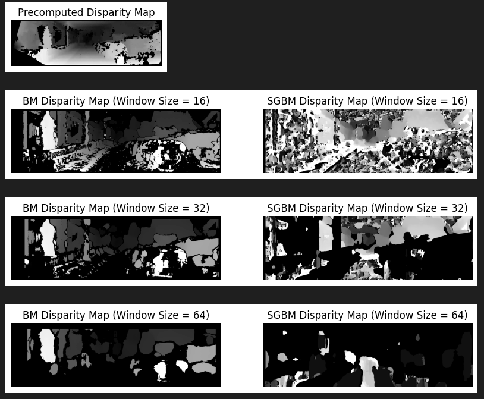
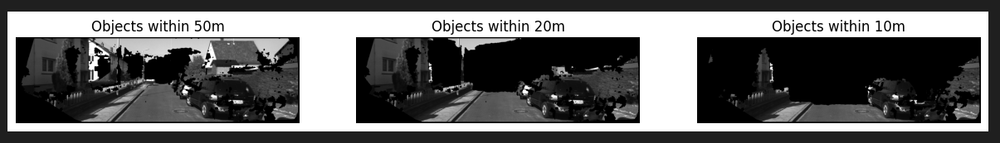

# ComputerVision
A repository featuring labs from my university's Computer Vision course, demonstrating practical applications in image processing, object detection, and segmentation.

## Computer Vision Course Projects

In this repository, I'll be documenting my progress through the Computer Vision course at my university. Throughout the course, we'll progressively implement five projects:

Project 1: Lane Detection
Project 2: Digit Recognition
Project 3: Image Stitching - Creating panoramas
Project 4: Stereo
Project 5: Object Detection using neural networks

All projects will be implemented using Python programming language and Jupyter notebooks.

Stay tuned for updates and explorations into the fascinating world of computer vision!

### Project #1 Week #1 Lane Detection Application
This project implements a lane detection application using Python, Jupyter Notebook, NumPy, and OpenCV. The application detects lane markings in images and overlays them with visualizations to highlight the detected lanes.

#### Overview
The lane detection pipeline consists of the following steps:
- Read the test image.
- Convert the image from BGR to RGB.
- Apply grayscale transformation.
- Apply Gaussian smoothing.
- Perform Canny edge detection.
- Define a region of interest.
- Apply a mask to the Canny edges.
- Overlay the detected edges on the original image.


### Week #2 Advanced Lane Detection by Fitting Lines Using Hough Transform

#### Project Overview
During Week 2 of development, the focus was on utilizing the Hough Transform to fit lines to the detected edges. While Canny edge detection provided edge information, converting these edges into lines required additional processing.

#### Hough Transform Overview:
The Hough Transform is a voting technique used to identify lines in an image.
It converts points in the image space to lines in the Hough space, allowing us to find lines based on edge points.

#### Using Hough Transform for Lane Detection:
Each edge point in the image space contributes to a set of possible parameters (m, b) in the Hough space.
The algorithm records all possible lines on which each edge point lies and identifies lines with the most votes.

#### Key Takeaways:
- Gaussian Blur: Removes noise from the image.
- Canny Edge Detection: Isolates edges in the image.
- Bitwise And Function: Isolates edges corresponding to lane lines.
- Hough Transform: Converts edges into lines for lane detection.


### Week #3: Evaluating Performance of Our Solution

#### Evaluation Metrics:

When trying out different segmentation methods, it's crucial to evaluate their performance to determine which one is best suited for the task at hand. If you have ground truth or gold standard segmentations available, you can employ various metrics to assess how closely each automated method aligns with the truth.

1. **Pixel Accuracy:**
   Pixel accuracy measures the percentage of pixels in the image that are classified correctly.
   
2. **Mean IoU (Mean Intersection over Union):**
   Mean IoU ranges from 0 to 1, with 0 indicating no overlap and 1 indicating perfect overlap between the predicted and ground truth segmentations.
   
3. **Precision:**
   Precision is a measure of exactness or quality.
   
4. **Recall:**
   Recall is a measure of completeness or quantity.
   
5. **F-Measure (Sørensen–Dice coefficient):**
   F-Measure is the harmonic mean of precision and recall, balancing both measures with equal weights. It indicates the algorithm's performance, with higher scores signifying better performance.
   
#### Computation of TP, FP, FN, TN in C++ using OpenCV:
- Given the Ground Truth (golden model) and our detected segmentation, we will compute the following metrics:
  1. TP, TN, FN, FP
  2. Accuracy, Mean IoU, Precision, Recall, F-measure


### Project #2 Week #1: License Plate Text Recognition

#### Label: B
#### Prediction output: B

1. **Introduction to Object Descriptors:**
Objects in images are represented as collections of pixels. To recognize objects, we need descriptors—specific sets of numbers describing the properties of these pixel groups. Object recognition involves matching descriptors computed for objects in images with those of known objects.

   - Shape descriptors characterize the arrangement of contour pixels (shape boundary, perimeter, margin).
   - Region descriptors define pixels within the object contour.

2. **Fourier Descriptors:**
Fourier Descriptors utilize Fourier theory properties to describe a shape. The concept involves characterizing a contour using a set of numbers representing the frequency content of the shape. By analyzing frequencies, a small number of Fourier coefficients are selected to describe the shape.

   - Fourier Descriptors (FD) are computed using the Discrete Fourier Transform (DFT) of complex numbers formed by the contour coordinates.
   - FDs represent 2D closed shapes independent of their location, scaling, rotation, and starting point.
   - Low-frequency FDs approximate the shape, while high-frequency components correspond to details susceptible to noise.
   
   To compute FDs:
   1. Find the object contour (using cv2.findContours).
   2. Create complex numbers using the (x, y) coordinates of the contour points: z = x + j*y.
   3. Compute the Fourier transform for every complex number.

3. **Hu Moments:**
Hu Moments describe the arrangement of pixels inside a curve by combining area, compactness, irregularity, and other curve descriptors. These moments provide global descriptions of a shape and are invariant to various image transformations.

   - Hu Moments are a set of 7 numbers calculated using central moments, invariant to translation, scale, rotation, and reflection.
   - The first 6 moments exhibit invariance to translation, scale, rotation, and reflection, while the 7th moment's sign changes for image reflection.

Hu Moments offer a compact and invariant representation of shapes, suitable for various image recognition tasks.

### Project #2 Week #2: Classification using SVM

Support Vector Machine (SVM) is a discriminative classifier formally defined by a separating hyperplane. Given labeled training data, the algorithm outputs an optimal hyperplane that categorizes new examples. 

#### Understanding the Optimal Hyperplane:

In the context of SVM, the term "optimal" refers to the hyperplane that maximizes the margin between different classes in the feature space. This margin represents the distance between the hyperplane and the closest data points, which are called support vectors.

#### Computing the Optimal Hyperplane:

The SVM algorithm operates by finding the hyperplane that maximizes the margin of the training data. The margin, defined as the distance between the hyperplane and the support vectors, plays a crucial role in determining the effectiveness of the classifier.

#### Implementation Details:
- SVM parameters are set using OpenCV's `cv2.ml.SVM_create()` function.
- Training data is prepared by extracting features and scaling them to a specific range.
- Features are extracted using Fourier Descriptors (FD) and Hu Moments.
- SVM is trained separately using FD, Hu Moments, and a combination of both.
- Testing is performed on sample images, and predictions are made based on the trained SVM models.

#### Code Implementation:
```python
# Set SVM parameters
svm = cv2.ml.SVM().create()
svm.setType(cv2.ml.SVM_C_SVC)  		# Use C-Support Vector Classification
svm.setKernel(cv2.ml.SVM_LINEAR)  	# Use Linear kernel

# Extract Fourier descriptors (FD) and Hu moments for each image
# Train the SVM
svm.train(trainingData, cv2.ml.ROW_SAMPLE, class_labels)

# Test on random image with FD + Hu Moments
# Compute features for the image
# Feed data to SVM and get prediction
```


#### Importance of Support Vectors:

Support vectors are the training examples closest to the hyperplane and play a crucial role in defining the optimal hyperplane. They determine the margin and are essential for generalization to new data.

#### Conclusion:

SVM offers an effective approach for classification tasks by finding the hyperplane that maximizes the margin between classes. Understanding the concepts of margin, support vectors, and the optimal hyperplane is fundamental to effectively apply SVM in various classification problems.


### Project #3 Week #1: Image Stitching - Creating Panoramas

#### Introduction
This project focuses on creating panoramas from multiple images captured in a sequence. The goal is to stitch together adjacent images seamlessly to create a wide-angle view of the scene.

#### Steps Involved
    Feature Detection and Description:
        Utilize the Scale-Invariant Feature Transform (SIFT) algorithm to detect keypoints and compute descriptors for each image.
        Extract keypoints and descriptors from each image in the sequence.

    Feature Matching:
        Use a feature matching algorithm (e.g., FLANN matcher) to match descriptor vectors between adjacent images.
        Filter matches using Lowe's ratio test to retain only good matches.

    Panorama Construction:
        Use the matched keypoints to estimate the transformation (e.g., homography) between adjacent images.
        Warp and blend images together to create a seamless panorama.

##### Implementation
    Implement SIFT algorithm for feature detection and description.
    Utilize FLANN matcher for feature matching.
    Implement Lowe's ratio test for filtering matches.
    Use OpenCV functions to estimate transformations and create panoramas.


### Project #3 Week #2: Advanced Image Stitching
#### Introduction
In Week 2 of Project 3, we delve into advanced techniques for image stitching, focusing on refining the stitching process and improving the quality of the panoramas generated.

#### Objectives
    Implement advanced feature detection algorithms to enhance keypoint detection.
    Explore robust matching techniques for more accurate keypoint matching across images.
    Refine the homography estimation process to improve alignment between images.
    Enhance blending methods to seamlessly merge adjacent images in the panorama.

#### Key Concepts
    - Advanced Feature Detection:
    In addition to SIFT, we explore other feature detection algorithms such as SURF (Speeded-Up Robust Features) and ORB (Oriented FAST and Rotated BRIEF) to identify keypoints in images more efficiently.

    - Improved Matching Techniques:
    We experiment with more sophisticated matching algorithms, including FLANN (Fast Library for Approximate Nearest Neighbors) and Brute-Force matching, to find correspondences between keypoints with higher accuracy.

    - Homography Refinement:
    Refining the homography estimation process involves optimizing parameters such as the number of matches required and the RANSAC threshold to obtain a more precise transformation between images.

    - Enhanced Blending Methods:
    Blending adjacent images in the panorama is crucial for achieving seamless transitions. We explore advanced blending techniques such as multi-band blending and feathering to improve the visual quality of the stitched panoramas.

#### Implementation Details
    Feature Detection: Utilize OpenCV's SURF and ORB algorithms for keypoint detection and descriptor computation.
    Matching Techniques: Experiment with FLANN and Brute-Force matching algorithms for feature matching.
    Homography Refinement: Fine-tune parameters such as the minimum number of matches and RANSAC threshold for homography estimation.
    Blending Methods: Implement multi-band blending and feathering techniques to blend adjacent images seamlessly.


### Project #4 Week #1: Stereo Object Detection

#### Introduction
Project #4 Week #1 focuses on stereo vision and object detection using stereo images. Stereo vision involves capturing images from two slightly different viewpoints, mimicking the human binocular vision. By analyzing the disparities between corresponding points in the stereo images, we can infer depth information and detect objects in the scene.

#### Objectives
1. Implement stereo vision algorithms for computing depth maps from stereo image pairs.
2. Utilize depth maps to detect objects within a specified range.
3. Visualize objects detected in the scene based on depth information.

#### Implementation Details
- **Stereo Vision Algorithms:** Implement stereo matching algorithms such as Block-Matching and Semi-Global Block Matching (SGBM) to compute depth maps from stereo image pairs.
- **Object Detection:** Use depth information to detect objects within predefined depth ranges, enabling the segmentation of objects based on their distance from the stereo camera.
- **Visualization:** Visualize the detected objects in the scene by overlaying depth-based masks onto the original images, providing insights into the spatial distribution of objects.

#### Code Implementation
- **Block-Matching Algorithm:** Implement the Block-Matching algorithm to compute the initial depth map from stereo images.
- **Semi-Global Block Matching (SGBM):** Utilize the SGBM algorithm for more accurate depth estimation and object detection.
- **Depth-based Object Segmentation:** Apply depth thresholding to segment objects within specified depth ranges, enabling selective visualization of objects at different distances.

#### Expected Output
- Depth Maps: Visualize the computed depth maps, highlighting disparities between corresponding points in the stereo images.
- Object Masks: Overlay depth-based masks onto the original images, indicating the presence of objects within predefined depth ranges.
- Depth-based Visualization: Display the stereo images with objects segmented based on their distance from the stereo camera, providing insights into the scene's spatial structure.

#### Conclusion
Project #4 Week #1 introduces stereo vision and object detection techniques, offering insights into the spatial layout of scenes and enabling applications such as obstacle detection, 3D reconstruction, and augmented reality. By leveraging stereo images and depth information, we can enhance perception and understanding of the environment, paving the way for advanced computer vision applications.




